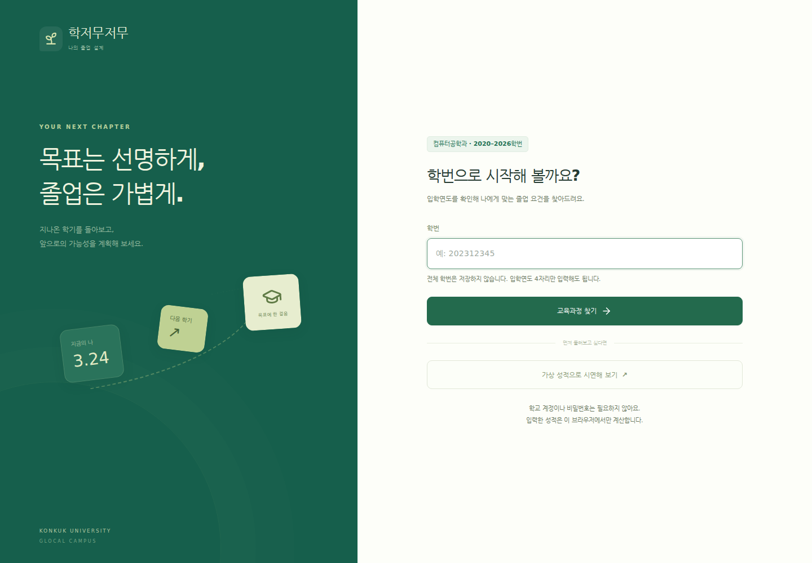
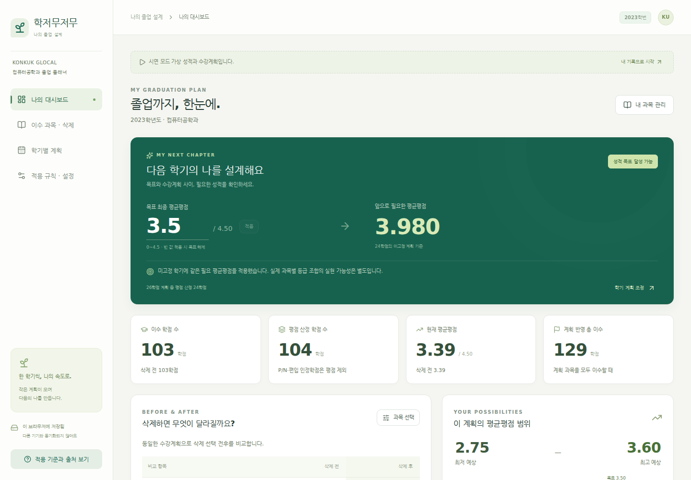

# 학저무저무

건국대학교 **GLOCAL캠퍼스 컴퓨터공학과** 학생을 위한 졸업·평균평점 시뮬레이터입니다. 2020~2026학번의 교육과정을 매칭하고, 취득학점포기 전후의 졸업 요건과 남은 학기에 필요한 성적을 함께 비교합니다.

컴퓨터공학과가 원전공 또는 복수전공에 포함된 **글로컬캠퍼스 내 조합**을 지원합니다. 편입·전과·복수전공은 학적 정보와 학교에서 확인한 개인별 인정 요건을 함께 사용합니다. 학교의 학적이나 실제 학점포기 신청을 변경하는 서비스는 아닙니다.

## 로컬 실행

Node.js 22.22 이상을 권장합니다. 별도 서버·DB·API 키는 필요하지 않습니다.

현재 작업 환경처럼 의존성이 설치되어 있으면:

```bash
./start.sh
```

브라우저에서 **http://localhost:5173**을 엽니다. 첫 화면의 **가상 성적으로 시연해 보기**로 바로 시작할 수 있습니다. `start.sh`는 Linux/WSL/macOS에서 사용할 수 있습니다.

협업자가 새 환경에서 내려받아 실행하려면 (Windows/macOS/Linux 공통):

```bash
git clone https://github.com/tls456/LINK.git
cd LINK
corepack pnpm install --frozen-lockfile
corepack pnpm dev
```

Corepack이 없거나 실행되지 않는 환경에서는 프로젝트 폴더에서 다음 명령을 사용합니다.

```bash
npm install -g pnpm@10.20.0
pnpm install --frozen-lockfile
pnpm dev
```

재현 가능한 설치에는 저장소의 `pnpm-lock.yaml`을 사용합니다. 이미 내려받은 협업자는 `git pull --ff-only` 후 의존성 설치와 실행 명령을 다시 실행하면 됩니다. 실제 성적과 브라우저 저장 데이터는 GitHub에 공유되지 않으며, 각자 첫 화면의 가상 시연 데이터를 사용할 수 있습니다.

```bash
corepack pnpm build     # TypeScript 검사와 배포용 정적 파일 생성
corepack pnpm preview   # 빌드 결과를 로컬에서 확인
```

배포는 필수 사항이 아닙니다. 빌드 결과는 `dist/`에 생성됩니다.

## PDF 성적표 일괄 입력

**이수 과목 · 삭제 → 성적표 PDF 가져오기**에서 텍스트 성적표(20MB·30페이지 이하)를 선택합니다. 과목명·학수번호·학기·학점·등급·이수구분을 추출하고, 등록된 시간표의 학수번호·이수구분·영역으로 교양 세부 영역을 매칭합니다. 미리보기에서 수정·제외한 뒤 **확인한 성적 반영**을 누릅니다.

- 동일 학기 시간표의 영역·학점이 일치하면 자동 분류합니다. 다른 학기 자료는 **후보만 표시**하며 영역 선택과 과목별 확인 체크 후 반영합니다. 자료 누락·충돌은 임의 추정하지 않습니다.
- 복수전공 전공 과목의 소속은 원전공/다전공을 직접 선택합니다. 인정·삭제 표시가 있으면 최종 성적 상태를 확인해야 합니다. 편입 인정은 별도로 체크합니다.
- 기존 기록에 추가하거나 전체 교체할 수 있습니다. 추가 시 동일 학기·학수번호는 건너뛰며 등급을 덮어쓰지 않습니다. 교체 시 명시적 동의가 필요하고 삭제 선택을 초기화합니다. 학적·개인별 요건·미래 계획은 유지합니다.
- PDF 원본·학생 이름·학번은 저장/업로드하지 않습니다. PDF 판독은 브라우저에서 수행하며 확정한 과목만 기존 자동 저장 설정을 따릅니다. 원본 학생 성적표는 테스트 자료나 Git에 포함하지 않습니다.
- 스캔 이미지·암호 PDF는 지원하지 않습니다. 판독 실패·취득학점 총량 차이를 경고하고 확인받습니다. 재수강·포기 이력과 삭제 한도 기준 취득학점은 사용자가 확인해야 합니다.

### 개발자: 학기별 시간표 갱신

Python 3 표준 라이브러리만 사용하며 추가 패키지 설치는 필요 없습니다. 엑셀은 개발자가 로컬에 보관하고, 아래 명령으로 필요한 교양 필드만 저장소에 등록합니다. 원본 전체 엑셀·담당교수·시간표 상세는 포함하지 않습니다.

```bash
python3 scripts/import-timetable.py "시간표.xlsx" --term 2026-2
# Windows에서 python3 대신 python을 사용할 수 있습니다.
```

단일 엑셀에는 학기가 없으므로 `--term`을 반드시 지정합니다. 같은 학기 자료를 갱신할 때는 확인 후 `--replace`를 붙입니다. 다른 학기는 기존 자료에 누적됩니다.

여러 학기 엑셀이 담긴 ZIP도 개발자가 한 번에 등록할 수 있습니다.

```bash
python3 scripts/import-timetable.py "시간표모음.zip" --dry-run
python3 scripts/import-timetable.py "시간표모음.zip"
```

ZIP 안 각 엑셀의 **파일명**에 `2025년 1학기`, `2025년 여름학기`처럼 학기가 명시되어 있어야 합니다. 파일명의 학기가 모호하거나 같은 학기가 중복되면 전체 등록을 중단합니다. ZIP의 내부 경로를 디스크에 풀지 않고 메모리에서 읽습니다. 모든 파일을 검증한 뒤 교양 필드만 JSON에 기록하며, 기존 학기와 겹치면 `--replace` 없이 덮어쓰지 않습니다. 이미 등록한 ZIP을 검증·갱신하려면 위 명령에 `--replace`를 추가하세요.

현재 **2020~2025년의 1·2·여름·겨울학기, 2026년 1·여름·2학기**까지 총 **27개 학기·3,044개 교양 분류 기록**(각 학기 분반 중복 제거)을 등록했습니다. 기존 2026-2 자료는 유지했습니다. 2026년 겨울학기는 제공되지 않았으므로 등록하지 않았습니다. 출처 파일명·학기·SHA-256을 기록하고 서로 충돌하는 영역은 그대로 남겨 자동 매칭을 막습니다. 과거 `인문언어`와 빈 영역은 현재 영역에 임의 변환하지 않고 확인 필요로 남깁니다.

생성되는 `src/data/timetables.json`을 리뷰하여 커밋하고 `pnpm test`, `pnpm test:timetables`, `pnpm build`로 검증하세요. Windows에서 Python 명령이 `python`이면 `python -m unittest discover -s scripts -p test_import_timetable.py`로 가져오기 테스트를 실행할 수 있습니다.

## 화면 예시





[모바일 대시보드](docs/screenshots/dashboard-mobile.png) · [과목 관리](docs/screenshots/courses-mobile.png) · [학기 계획](docs/screenshots/plan-mobile.png)

모든 예시 성적은 가상 데이터입니다. 요람에 없는 시연용 과목은 `[가상]`으로 구분합니다.

## 구현 현황

| 구분 | 기능 | 구현 내용 |
| --- | --- | --- |
| MUST FR-01 | 규칙 설정 | 학번·학적·교육과정 매칭, 공식 출처와 확인일, 개인별 확인 요건 |
| MUST FR-02 | 이수 과목 | 추가·수정·입력 제거, 과목 코드·구분·학점 수·등급 검증 |
| MUST FR-03 | 졸업 대조 | 총량·영역·필수 과목·선택필수 그룹·교양 영역 수, 현재/삭제 후/계획 후 비교 |
| MUST FR-04 | 취득학점포기 | 자격·신청 차수·수료 기준·실제 추가 선택 조합, 불가 선택 차단, 선택 되돌리기 |
| MUST FR-05 | 목표 성적 | 미래 평점 산정 학점 수를 이용한 필요 평균 역산, 불가·산정 대상 없음 구분 |
| MUST FR-06 | 학기 계획 | 학기·계획 과목 추가 및 수정, 평점/PF 구분, 목표 고정·해제 및 재계산 |
| MUST FR-07 | 대시보드 | 같은 미래 계획의 삭제 전후 비교, 부족 요건·오류·확인 필요 표시 |
| SHOULD | 저장 | 브라우저 자동 저장·복원, JSON 백업·가져오기, 저장 끄기·전체 초기화 |
| SHOULD | 가능 범위 | 고정 학기 목표를 유지한 예상 누적 평균평점 최저·최고 |
| COULD | 화면 | 데스크톱·모바일 반응형, 키보드 조작·입력 오류·텍스트 상태 |
| COULD | 자격증 안내 | 이번 범위에 포함하지 않음 |

자동 확인할 수 없는 학교 규정이나 개인별 승인 내역을 임의로 채우지 않습니다. **확인 필요** 상태를 표시하고, 학교 확인자료를 입력하면 해당 개인 요건을 계산에 반영합니다.

## 3분 시연 순서

1. 첫 화면에서 **가상 성적으로 시연해 보기**를 누릅니다. 목표 3.50과 앞으로 필요한 평균평점, 예상 범위를 설명합니다.
2. **이수 과목 · 삭제**에서 C/C+ 과목을 하나 선택합니다. 삭제 전후 평균평점, 졸업 이수 학점 수와 필요 평균평점의 차이를 확인합니다.
3. F 과목을 선택합니다. 평점 분모는 줄지만 삭제 한도 사용량은 늘지 않는 것을 확인합니다. 선택을 해제해 원래 결과로 되돌립니다.
4. **학기별 계획**에서 첫 학기의 목표를 고정합니다. 다른 학기에 필요한 평균평점이 달라지는 것을 확인합니다.
5. **적용 규칙 · 설정 → 학적 정보 수정**에서 학번이나 복수전공 선발연도를 바꿉니다. 학번과 선발연도가 다른 교육과정에 연결되는 것을 설명합니다.
6. **개인별 요건 입력**에서 확인자료·필수 과목·영역 기준을 추가합니다. 학적이 바뀌면 이전 개인자료 적용을 보류하고 재확인을 요구합니다.
7. 새로고침해 기록을 복원하고, 필요하면 JSON 백업 후 초기화합니다.

시연 데이터도 실제 학교의 최종 졸업 가능 여부를 보증하지 않습니다. 필수 교양·졸업작품·개인별 인정 등 남은 조건을 함께 보여 주는 예시입니다.

## 적용 규칙과 공식 출처

자료 확인일: **2026-10-02**. 규칙 버전: `kku-2020-2026-checked-2026-10-02`.

- [GLOCAL캠퍼스 공식 요람](https://www.kku.ac.kr/cms/FR_CON/index.do?MENU_ID=590): 2020~2026학년도 총괄표·학과 교육과정·교양 기준. 게시물·PDF·쪽 번호를 코드와 화면에 기록했습니다.
- [학칙시행세칙 Ⅰ](https://rule.konkuk.ac.kr/lmxsrv/law/lawFullContent.do?SEQ=410&SEQ_HISTORY=3648): 교육과정 적용, 다전공, 취득학점포기.
- [GLOCAL 취득학점포기 안내](https://www.kku.ac.kr/cms/FR_CON/index.do?CONTENTS_NO=18&MENU_ID=1320&P_TAB_NO=18): 신청 자격과 차수별 계산.
- [2026년 1학기 2차 학사지원팀 공지](https://www.kku.ac.kr/cms/FR_CON/BoardView.do?BBS_SEQ=120116&BOARD_SEQ=18&MENU_ID=1740&SITE_NO=2): 당해 학기 포함, 편입 인정학점 제외, 포기 횟수 제한 없음.
- [성적·시험 안내](https://www.kku.ac.kr/cms/FR_CON/index.do?CONTENTS_NO=9&MENU_ID=1320&P_TAB_NO=9), [수료·졸업 안내](https://www.kku.ac.kr/cms/FR_CON/index.do?CONTENTS_NO=5&MENU_ID=1320&P_TAB_NO=5).

교육과정 매칭은 신입학의 입학연도, 편입학의 적용 동학년 교육과정, 다전공의 선발연도를 구분합니다. 전과·복학 등은 학교에서 확인한 적용연도를 명시할 수 있습니다. 2020학번 컴공은 당시 소프트웨어전공에 연결합니다. 서울캠퍼스 컴퓨터공학부 자료는 적용하지 않습니다.

학과·연도 225개 행과 전공필수 교과목 1,657개 항목, 선택필수 11개 그룹을 수록했습니다. 7년 총괄표와 컴공·주요 예외는 원문 표 이미지로 확인했고, 나머지 과목은 공식 PDF 텍스트 추출과 학과 매핑·합계·중복·출처 검증을 사용했습니다. 학교가 이 앱의 데이터나 판정을 인증한 것은 아닙니다.

### 학점포기

- 재학 여부·등록학기 수·등급·편입 인정 여부·신청 차수의 성적 범위를 검사합니다.
- 1차: 직전학기까지의 총 취득학점 − 직전학기 수료인정학점.
- 2차: 당해학기를 포함한 총 취득학점 − 당해학기 수료인정학점.
- 이미 확정된 포기는 기준 총 취득학점에 반영된 상태로 입력합니다. 미반영된 같은 차수의 신청량만 별도로 입력하므로 과거 포기량을 이중 차감하지 않습니다.
- F/N은 취득학점이 없으므로 삭제 한도 소진량이 0입니다. 편입 인정학점은 포기할 수 없고 GPA에도 반영하지 않습니다.
- ‘남은 한도’와 ‘실제로 추가 선택할 수 있는 최대 한도 사용량’을 구분합니다. 예를 들어 한도 5에 후보 3+3이면 실제 최대는 3입니다.

사용자와 합의한 기준에 따라 **최신 학칙·2026 공지**를 우선 적용합니다. 2024~2026 요람의 ‘수강신청 한도학점 내’ 문구와 차이가 있다는 사실도 화면에 표시합니다.

### 개인별 확인자료

자료명·확인 내용·확인일과 함께 필수과목/선택그룹, 영역 최소학점, 승인받은 면제, 미확정 사항의 해결 여부, 비학점 요건의 충족을 입력합니다. **사용자 확인자료**로 표시하며 공식 데이터와 구분합니다.

추가 입력은 확인 버튼을 눌러야 적용됩니다. 형식·출처·날짜·기존 요건 참조 중 하나라도 잘못되거나 학적 문맥이 바뀌면, 저장본을 보존하면서 개인 요건 전체 적용을 보류합니다. 등록학기·삭제 차수 변경만으로 교육과정 확인자료가 무효화되지는 않습니다.

## 계산식

이수 학점 수 `C`, 평점 산정 학점 수 `W`, 학점 수×환산 평점 합 `S`를 별도로 집계합니다. 현재 평균평점은 `S / W`입니다. 학교 등급표는 A+ 4.5, A 4.0, B+ 3.5, B 3.0, C+ 2.5, C 2.0, D+ 1.5, D 1.0, F 0이며 P/N은 평점에서 제외됩니다. 공지의 NP 입력은 N으로 정규화합니다.

```text
삭제 후 누적값: W′, S′
미래 평점 산정 학점 수: N
목표 최종 평균평점: T
필요 평균평점 = (T × (W′ + N) − S′) / N

고정 학기 성적 기여 합: B
미고정 학기 평점 산정 학점 수: U
미고정 학기의 필요 평균 = (T × (W′ + N) − S′ − B) / U
```

기획서 예시: 현재 60학점·평균 3.00, 목표 3.50, 미래 60학점이면 필요 평균은 4.00입니다. 3학점·평점 1.00 과목 삭제 후 미래 63학점이면 약 3.857143, 미래 60학점이면 3.875이며 졸업 기준 120학점에서 3학점이 부족합니다.

성적 기여·판정에는 1,000배 정수와 정수 비율을 사용합니다. 현재 평균은 소수 둘째 자리 반올림, 필요 최소 평균은 셋째 자리 올림으로 표시하며 표시 문자열로 다시 계산하지 않습니다. 미래 과목이 없거나 모두 고정된 경우에는 예상 누적값으로 목표를 검사합니다. 최고 평점을 넘는 필요값은 잘라내지 않고 달성 불가로 표시합니다.

예상 범위의 최저값은 미래 일반 과목에 F를 적용할 수 있으므로 **졸업 가능한 평균평점 범위**를 의미하지 않습니다. 고정한 학기 목표는 범위 계산에서도 유지합니다.

## 저장과 데이터 처리

- 저장 위치: 현재 브라우저·현재 주소(origin)의 `localStorage`, 키 `hakjeo-mujeomu:v1`.
- 저장 내용: 입학·교육과정 정보, 과목·등급, 삭제 선택, 목표, 학기 계획, 개인 확인자료. 전체 학번은 저장하지 않습니다.
- 새로고침 시 원본 입력을 복원하고 규칙으로 재계산합니다. 계산 결과 자체를 정답 데이터로 저장하지 않습니다.
- 다른 브라우저·PC와 자동 동기화되지 않습니다. `localhost`와 `127.0.0.1`, 포트가 다른 주소도 저장 공간이 다릅니다.
- 설정에서 자동 저장을 끄면 저장본을 제거하고 현재 탭의 입력은 유지합니다. 전체 초기화는 확인 후 저장본과 현재 입력을 제거합니다.
- JSON 백업에는 성적 정보가 포함됩니다. 실제 학생 데이터나 백업을 Git에 넣지 마세요.
- 외부 학사 시스템 연결, 계정 인증, 성적 수집·서버 전송은 없습니다. 데이터·등급·확인자료를 브라우저 밖으로 전송하지 않습니다.

## 기술 구성과 모듈

React + TypeScript + Vite, Lucide 아이콘, Vitest, Playwright를 사용합니다.

| 위치 | 책임 |
| --- | --- |
| `src/data/academic.ts` | 등급·학적 매칭·수료/포기 규칙 및 공식 출처 |
| `src/data/catalog.ts`, `required-courses.ts` | 연도별 학과·교양·필수과목 데이터 |
| `src/domain/engine.ts` | 화면에 의존하지 않는 검증·성적·졸업·삭제 조합 계산 |
| `src/domain/buildProfile.ts`, `personal.ts`, `simulator.ts` | 학적을 규칙으로 연결, 개인 확인자료 적용 |
| `src/state.ts` | 저장 형식과 복원 검증 |
| `src/pdf.ts`, `src/domain/transcript.ts` | 로컬 PDF 문자 추출·시간표 분류·가져오기 검증 |
| `scripts/import-timetable.py`, `src/data/timetables.json` | 개발자용 학기별 시간표 등록·교양 영역 자료 |
| `src/components/` | 학번 입력·과목·계획·대시보드·규칙 화면 |
| `tests/` | 브라우저에서 실제 입력·복원·모바일 흐름 검증 |

팀원 이름과 실제 역할은 아직 제공되지 않아 기재하지 않았습니다. 계산/규칙, 화면/입력, 통합/문서의 모듈 경계로 역할을 나눌 수 있습니다.

## 테스트

```bash
corepack pnpm test
corepack pnpm test:timetables  # Python 3 표준 라이브러리 기반 ZIP/XLSX 가져오기 검증
corepack pnpm exec playwright install chromium
corepack pnpm exec playwright install-deps chromium  # 필요한 Linux 환경에서만
corepack pnpm test:e2e
```

계산 테스트는 기획서 T01~T11과 200과목 성능, F/P/편입 처리, 삭제 조합, 선택 복원, 고정 목표, 미확정 규칙을 검증합니다. T12는 저장 형식 테스트와 실제 브라우저 새로고침 테스트로 확인합니다. 브라우저 테스트에는 개인 확인자료 적용·교육과정 변경 시 재확인과 마지막 평점 과목 제거 후 잠금 해제도 포함합니다.

검증 환경과 최종 결과는 [검증 기록](docs/verification.json)에 기록합니다. 순수 계산 성능과 브라우저 사용자 흐름 검증은 구분합니다.

2026-10-02 시간표 확장 검증에서 단위·통합 테스트 186개, 시간표 가져오기 테스트 8개, 브라우저 테스트 11개가 통과했습니다. 제공받은 실제 성적표도 로컬 브라우저에서 27과목·60학점으로 추출되어, 누락 영역/인정 상태 확인 후 일괄 입력됨을 확인했습니다. 이 성적표에서 다른 학기 자료 후보는 기존 15개에서 0개로 줄었습니다. 전체 이수 학기 자료가 등록되어도 빈 영역·인정/삭제 표시는 별도로 확인받습니다. 실제 자료는 저장소에 포함하지 않고 자동화 테스트는 가상 성적표만 사용합니다.

PDF 추가 전 200과목을 20회 측정한 최대 시간은 전체 계산 10.70ms, React 화면 갱신 326.70ms로 개발 목표인 1초 이내였습니다. 동일한 로컬 서버를 켠 뒤 `corepack pnpm benchmark`로 측정할 수 있습니다. 수치는 해당 장비·브라우저에서의 측정값이며 모든 환경의 성능을 보증하지 않습니다.

## 제한 및 확인 사항

- 재수강 자동 성적 대체·중복 인정, 동일/대체 과목 자동 매핑은 지원하지 않습니다. 학교에서 최종 반영된 성적과 이수구분을 입력합니다. 이름이 같다는 이유로 다른 이수 기록을 차단하지 않습니다.
- 소수 학점, 외국인·해외대학 등의 특별 기준, 계절학기 취득학점포기 반영 시점, 확인된 수료표 밖의 학기는 별도 확인이 필요합니다.
- 편입 교양 면제·인정, 전과 전 기록의 이수구분, 다전공 전필 적용·전입 제한 등 개인별 사항은 확인자료로 보완합니다. 앱에서 선택할 수 있다는 것이 해당 조합의 학교 선발 허가를 의미하지는 않습니다.
- 2020 패션디자인전공은 요람 총괄표 전필 2학점과 학과 과목표 합계 14학점이 충돌합니다. 자동 확정하지 않고 해당 조합에 확인 필요를 표시합니다.
- 전과생의 교양 교육과정과 전공 적용연도가 다른 경우, 개인별 기준으로 교양 영역·필수과목을 보완해야 합니다.
- 실제 개설 여부·학기 수강신청 상한의 예외·시간표·인증·졸업작품 심사 등은 자동 승인하지 않습니다. 단순 확인과 실제 충족을 구분합니다.
- 미래 과목의 졸업 요건은 모두 이수·인정된다는 조건부 결과입니다. 연속적인 필요 평균이 실제 등급 조합에서 정확히 만들어지는지까지 보장하지 않습니다.
- 학교의 최종 성적 반올림·절사 기준을 확인한 것으로 간주하지 않습니다. 이 앱의 표시 정밀도는 기획서 기준입니다.
